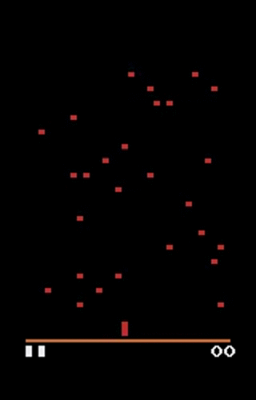

An implementation of Deep Q-Network, a reinforcement learning 
agent that uses deep learning for the action value function.
(DeepMind's paper [https://arxiv.org/abs/1312.5602] 
[https://storage.googleapis.com/deepmind-media/dqn/DQNNaturePaper.pdf])

To run: `python dqn.py`  
This will start training a DQN on an Atari game.

`python run_dqn.py` to run trained model for one episode.

Pong  

Centipede  
